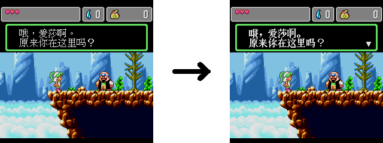

# 《怪物世界4》汉化版字体修订补丁

## 声明

这个只是一个字体修订补丁，而不是汉化补丁。

字体修订补丁仅供研究学习使用。**由于原始汉化未署名，如果转载此补丁，请不要提及补丁出处与作者**！

## 使用方法

下载补丁 `patch.ips` 。
- 补丁需要应用在《怪物世界4》汉化版（2021年，作者未知，简体版）
- 该ROM的md5值为 `49b984ce80ab1ebbbc215335ffa35046` 。

访问 [ROM Patcher JS](https://www.marcrobledo.com/RomPatcher.js) 打补丁。
- 在 `ROM file` / `ROM文件` 处，选择ROM。
- 在 `Patch file` / `补丁文件` 处，选择 `patch.ips` 。
- 选择 `Apply Patch` / `打补丁` ，输出打好补丁的ROM。

另外，还提供一个 `patch-alt.ips` 。
- 这个是应用在《怪物世界4》汉化版（2019年，作者WOLFTEAM，简体版v2）的版本。
- 该ROM的md5值为 `02123913fd803e1e73f70bd446c4dc4f` 。

## 修订流程与内容

### 字库

本补丁使用 `粗宋` 字体替换汉化字体，原始日文字体实际上是某种字体直接加粗实现。

事先生成与游戏中字体一致的所有可能字模作为参考数据，命名为 `FontOrigin.bin` ；使用 `粗宋` 生成每个对应的字模，命名为 `FontUpdate.bin` 。

使用 `FontReplace.c` 编译的程序，搜索 `0x0017EA72 - 0x00185DF2` 和 `0x00175E76 - 0x001787B6` 两个段落的字模数据，寻找匹配和替换字模。

然后，需要使用 `CrystalTile1` 去对应段落手工替换一些 `粗宋` 没有或没有匹配成功的字模。

### 图像

使用 `CystalTile2` 修订标题菜单的内容，数据段在 `0x001462C0 - 0x00146AC0` ， 以及 `0x001482C0 - 0x0001488C0` 。

使用 `CystalTile2` 修订游戏菜单的内容，数据段在 `0x001AD4A0 - 0x001AD5A0` （仅2021年汉化版）

### 校验修正

使用 `Sega Genesis Checksum Utility` 修正ROM的校验值。

## 参考
- [《怪物世界4》汉化版](https://bbs.oldmanemu.net/thread-11025.htm) - 2021年，作者未知，简体版
- [《怪物世界4》汉化版](http://www.nesbbs.com/bbs/forum.php?mod=viewthread&tid=47667) - 2019年，作者WOLFTEAM，简体版v2
- [粗宋](https://diaowinner.itch.io/chusung) - 汉化使用字体
- [Sega Genesis Checksum Utility](https://github.com/mrhappyasthma/Sega-Genesis-Checksum-Utility) - ROM校验值修订
- [ROM Patcher JS](https://www.marcrobledo.com/RomPatcher.js) - ROM应用/制作补丁工具
- CrystalTile1 - 参考字库生成、ROM字库补充修订
- CrystalTile2 - MD图像导入/导出
- [Aseprite](https://www.aseprite.org) - 图像编辑
